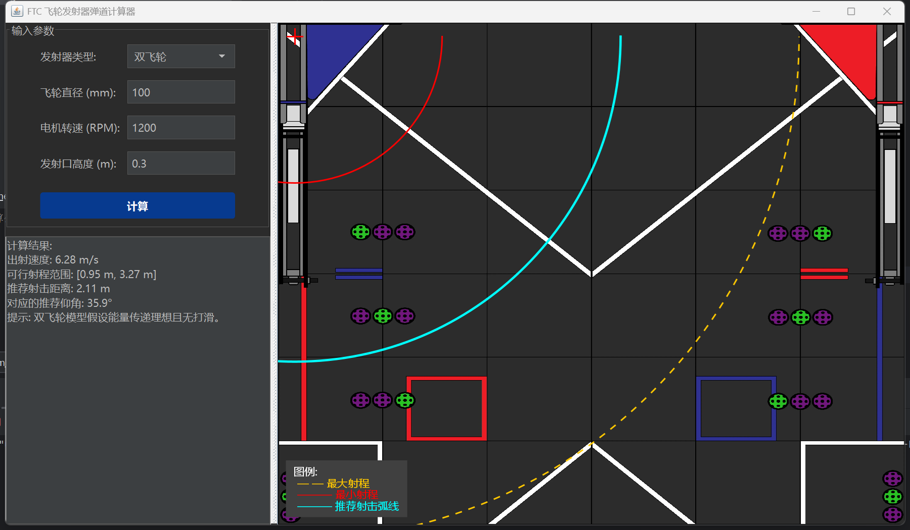

FTC 飞轮发射器弹道计算器 (FTC Flywheel Ballistics Calculator)

一款专为 FTC (FIRST Tech Challenge) 机器人竞赛队伍设计的桌面应用，旨在通过精确的物理模型和可视化界面，辅助计算单飞轮或双飞轮发射机构的理想发射参数。
A desktop application designed for FTC (FIRST Tech Challenge) robotics teams to assist in calculating ideal launch parameters for single or dual flywheel launchers, featuring an accurate physics model and a visual interface.

✨ 核心功能 (Core Features)
双物理模型 (Dual Physics Models):
单飞轮+弧面 (Single Flywheel + Hood): 采用精细的能量传递模型，允许用户动态调整压缩量、摩擦系数 (μ) 和球体弹性系数 (k)，以精确模拟真实世界的能量损失和传递效率。
双飞轮 (Dual Flywheel): 采用理想化的无打滑模型，适用于快速基准测试。
参数化计算 (Parametric Calculation): 根据输入的物理参数（飞轮直径、电机转速、发射高度等），实时计算出：
出射速度 (Exit Velocity)
可行射程范围 (Feasible Range) [最小射程, 最大射程]
推荐发射仰角 (Recommended Launch Angle)
场地可视化 (Field Visualization): 在场地图片上，根据计算结果动态绘制出：
最小/最大射程弧线 (Min/Max Range Arcs)，清晰地标示出有效射击区域。
推荐射击位置弧线 (Recommended Shooting Position Arc)，为机器人定位提供直观参考。
跨平台支持 (Cross-Platform): 通过 jpackage 和 GitHub Actions 自动打包，生成适用于 Windows (.exe) 和 macOS (.dmg) 的原生安装包，无需用户预先安装Java环境。
现代化UI (Modern UI): 采用定制化的蓝黑主题，提供美观、简洁且响应迅速的用户操作界面。
🎯 目标用户 (Target Audience)
主要面向参加 FTC 机器人竞赛，并使用飞轮作为得分手段的队伍的机械组、编程组队员及教练。通过本工具，队伍可以：
在设计阶段快速验证不同物理参数组合的可行性。
通过微调摩擦和弹性系数，将模型校准得与真实机器人性能高度一致。
在调试阶段为自动程序提供精确的角度和距离参考，节省大量的物理测试时间。
🚀 如何使用 (How to Use)
作为普通用户，您无需关心源代码。只需下载已打包好的应用程序即可。
前往本仓库的 Releases 页面。
在最新的版本（例如 v1.1.0）下，找到 Assets 区域。
根据您的操作系统，下载对应的安装包：
Windows 用户: 下载 Windows-Installer-x.x.x.exe。
macOS 用户: 下载 macOS-Installer-x.x.x.dmg。
注意: 由于应用没有代码签名，首次运行时可能会收到安全警告。
在 Windows 上，您可能需要点击“更多信息” -> “仍要运行”。
在 macOS 上，您可能需要在“系统设置” -> “隐私与安全性”中允许应用运行，或者右键点击应用图标 -> “打开”。
👨‍💻 如何从源码构建 (How to Build from Source)
如果您是开发者，并希望自行修改或构建此项目，请按以下步骤操作。
先决条件 (Prerequisites)
Git
JDK (Java Development Kit) 17 或更高版本
Apache Maven
构建步骤 (Steps)
克隆仓库:
code
Bash
git clone https://github.com/Lucalmz/FTC-FlywheelCalculator-27570.git
cd FTC-FlywheelCalculator-27570
使用 Maven 打包:
此命令会自动编译所有源代码，并将它们打包成一个可执行的 .jar 文件。
code
Bash
mvn package
运行应用:
构建成功后，可执行的 .jar 文件会位于 target/ 目录下。
code
Bash
java -jar target/FlywheelCalculator-*.jar
(使用 * 通配符可以匹配任何版本号)
🛠️ 技术栈 (Technology Stack)
语言 (Language): Java 17
图形界面 (GUI): Java Swing (使用完全自定义的组件以确保跨平台观感一致)
构建工具 (Build Tool): Apache Maven
打包与分发 (Packaging & Distribution): jpackage & GitHub Actions
📄 许可证 (License)
本项目采用 MIT 许可证。